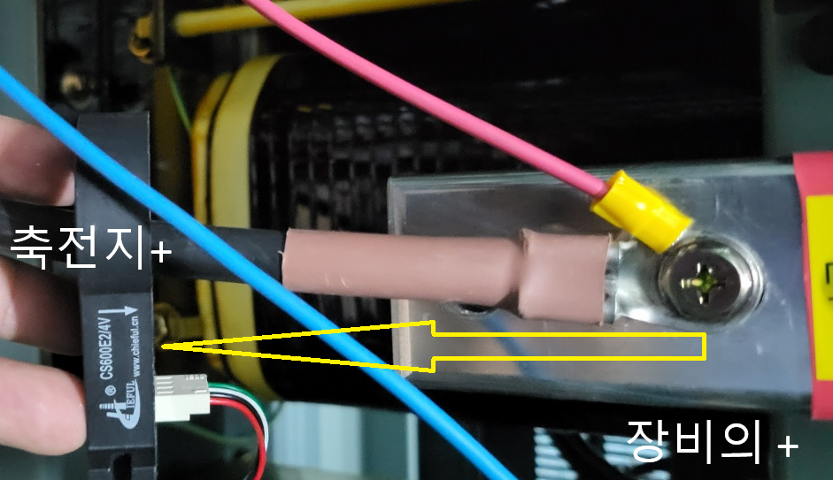

# POSCO Battery Management System
## 2025.06.25 
# 100KVA용 BMS 설치 자재 
* Main Bms : UPS에 부착하여 출고
* 센서BMS : 19개 
    - 센서간 연결 UPT Cable : 19개 
    - 2:1 UTP Jointer 1개
        UTP : 7,8 라인은 
    - 축전지 단자러그 산출 : 모듈에 설치된 배터리수 +1   
      ex) 290셀은 16셀용 17모듈, 9셀용 2모듈   
            17* 17 + 2*10  = 309개   
* 전류센서 모듈 : CS600E2/4V
* 전류센서 연결용 케이블(3M)

## 설치 방법. 
* UTP Jointer 사용
    - 모듈에 연결되는 라인은 가장 가까운 곳에 연결한다.
    - 배터리 함에서는 전원라인과 통신라인 두개가 결합되어 1개의 라인으로 센서모듈에 연결된다.
    - 전원라인 +15V: 1,2,4(오랜지띠, 오렌지, 청색) : +15V의 단자대에 연결
    - 전원라인 GND : 3,5,6(녹띠,녹,청띠) : 단자대의 -에  연결
    - RS485라인 : UPS에서 연결된 UTP라인을 체결  

      
* 전류센서는 1번 장비에 연결한다.    
* 설치시 전류센서의 설치
  + 라인에 연결할 경우 사진과 같이 CT의 커넥터가 장비 방향으로 향하게 연결하며   
  - 라인에 연결할 경우 CT의 커넥터가 축전지 방향으로 향하게 설치한다. 
      
* 모듈의 설치는 1개의 모듈에는  6~16개를 설치하며   
  16셀의 경우 1번 핀은 -로 시작 하며, 2번 + ,,,, 16+로 총 17개의 라인이 연결된다. 